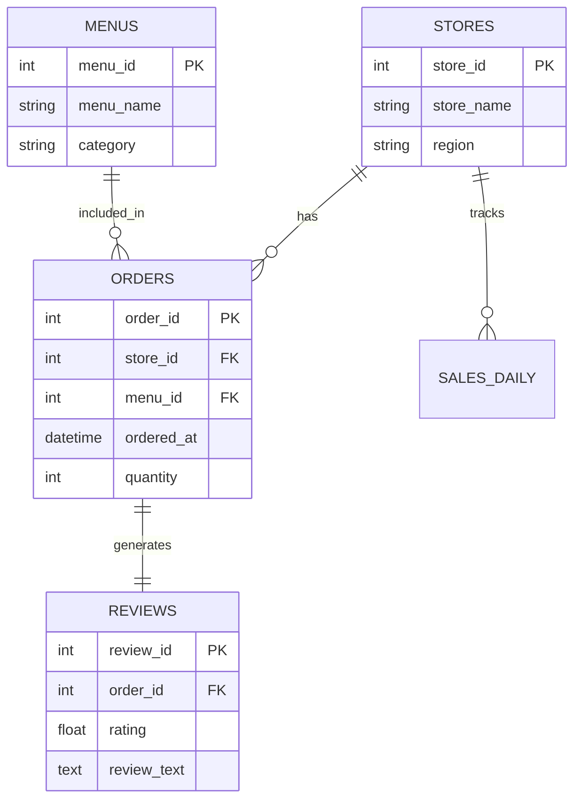

# � AI Franchise Manager (SOS Project)

**"데이터 기반의 똑똑한 매장 관리 파트너 (AI 점장)"**  
LangGraph와 LLM을 활용한 **지능형 매장 관리 에이전트 서비스**입니다.  
단순한 챗봇을 넘어 SQL을 통한 **실시간 매출 분석**, **운영 매뉴얼 RAG 검색**, 그리고 **자동 웹 검색(Fallback)**을 통해 점주들의 의사결정을 지원합니다.

---

## 🏗️ System Architecture (Flow)

이 프로젝트는 **LangGraph**를 사용하여 **Stateful Multi-Agent Workflow**를 구현했습니다.

```mermaid
graph LR
    User(👤 점주) -->|질문 입력| Router{🤖 Intent Router}
    
    subgraph "Core Agent Modules"
        Router -->|매출 문의| Diagnosis[📊 Diagnosis Agent\nSQL Generation]
        Router -->|규정/매뉴얼| Manual[📘 Manual RAG\nVector Search]
    end
    
    Diagnosis -->|Data Context| Answer[💬 Answer Synthesis]
    Manual -->|Docs| Validation{✅ AI Context Check}
    
    Validation -->|관련성 낮음| Web[🌐 Google Search\n(Gemini Grounding)]
    Validation -->|관련성 높음| Answer
    Web -->|Web Results| Answer
    
    Answer -->|Structured JSON| UI[💻 Streamlit UI\nChart & Dashboard]
```

---

## ✨ Key Features (핵심 기능)

### 1. 📊 실시간 매출 분석 (Data-Driven Insight)
- 자연어 질문을 **SQL로 자동 변환**하여 DB에서 정확한 매출 데이터를 추출합니다.
- **Smart Period Logic**: 시스템 날짜가 아닌, **DB의 최신 데이터 날짜**를 기준으로 분석 기간을 자동 설정하여 정확도를 보장합니다.
- **Visual Report**: 분석 결과를 **Altair 차트**와 **핵심 지표(KPI) 카드**로 시각화하여 제공합니다.

### 2. 🛡️ 할루시네이션 방지 (Hallucination Control)
- **Fact Check**: DB에 데이터가 없으면 거짓 정보를 생성하지 않고 **"데이터 없음"**을 명확히 고지합니다.
- **Review Binding**: 메뉴 분석 시 실제 고객 리뷰 데이터를 정확히 매핑하여 근거를 제시합니다.

### 3. 🌐 하이브리드 검색 (RAG + Google Grounding)
- 내부 매뉴얼(RAG) 검색 결과의 **유사도(Similarity)**가 낮거나 맥락이 맞지 않을 경우, **Gemini 2.0 Grounding**을 통해 최신 웹 정보를 검색합니다.
- 단순 검색 API(Tavily 등)가 아닌, **LLM 자체의 Grounding 기능**을 활용하여 신뢰도 높은 답변을 생성합니다.

---

## 🛠️ Technology Stack

| Category | Stack | Description |
| :--- | :--- | :--- |
| **LLM Orchestration** | **LangChain, LangGraph** | Multi-Agent State Management & Workflow |
| **Model** | **OpenAI GPT-4o** | Reasoning & Intent Routing |
| **Search Engine** | **Gemini 2.0 Flash** | **Google Search Grounding** (Real-time Web Search) |
| **Backend** | **FastAPI** | Asynchronous REST API Server |
| **Database** | **PostgreSQL** | Relational Data Storage (Sales, Stores, Reviews) |
| **Vector DB** | **ChromaDB / FAISS** | Semantic Search for RAG |
| **Frontend** | **Streamlit** | Interactive Dashboard UI |
| **Deployment** | **AWS EC2 (Ubuntu)** | Cloud Server Environment |

---

## 💾 Database Schema (ERD)

매장의 핵심 데이터를 효율적으로 관리하기 위해 정규화된 RDBMS 설계를 적용했습니다.



---

## 📁 Project Structure

```bash
📦 AiProjectLangGraph
├── 📂 app
│   ├── 📂 core          # DB Connection, Config
│   ├── 📂 inquiry       # LangGraph Agents (Diagnosis, Manual)
│   └── 📂 manual        # RAG Vector Store Logic
├── 📂 ui
│   ├── 📄 main_ui.py    # Streamlit Entry Point
│   ├── 📄 inquiry_page.py # User Chat Interface
│   └── 📄 about_project.py # Architecture Visualization
└── � README.md         # Project Documentation
```