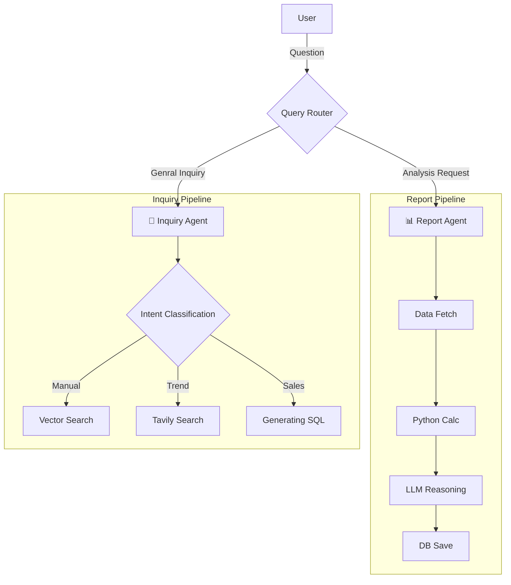

# 📘 AI Franchise Manager: Technical Whitepaper
> **"데이터로 사고하고, 맥락으로 대화하는 자율형 매장 관리 에이전트"**  
> **Development Period**: 2024.12 ~ 2025.01 (1 Month)  
> **Role**: Full Stack Developer & AI Engineer (1인 개발)

---

## � Table of Contents
1. **Project Overview** (개요)
2. **Planning Intent** (기획 의도)
3. **Tech Stack Strategy** (기술 선정 이유)
4. **Database Schema** (데이터 구조)
5. **System Architecture** (시스템 설계)
6. **API Specification** (API 명세)
7. **Core Feature 1: Report Agent** (자동 분석)
8. **Core Feature 2: Inquiry Agent** (대화형 비서)
9. **Log #1: AWS RDS Connection** (트러블슈팅)
10. **Log #2: LLM JSON Parsing** (트러블슈팅)
11. **Log #3: RAG Accuracy** (트러블슈팅)
12. **Future Roadmap** (향후 계획)

---

## 1. 📘 Project Overview
**AI Franchise Manager**는 프랜차이즈 가맹점주가 겪는 '데이터 분석의 어려움'과 '운영 매뉴얼 숙지의 불편함'을 해결하기 위해 개발된 **All-in-One AI 솔루션**입니다. 단순한 대시보드를 넘어, AI가 먼저 데이터를 파고들어 인사이트를 떠먹여 주는(Proactive) 경험을 제공합니다.

---

## 2. 🎯 Planning Intent
### "사장님은 요리에만 집중하세요, 분석은 AI가 합니다."
- **Why?**: 자영업자 90%는 포스기(POS)에 찍히는 매출 숫자를 볼 뿐, "왜 매출이 올랐는지/떨어졌는지" 분석할 시간도 능력도 부족합니다.
- **Goal**: 
  1. **Automation**: 매일/매주 클릭 없이도 분석 보고서 자동 생성
  2. **Accessibility**: 복잡한 검색 대신 채팅으로 "배달비 규정이 뭐지?" 물어보면 즉답
  3. **Reliability**: 그럴싸한 거짓말(Hallucination) 없는 신뢰성 있는 AI 구축

---

## 3. 🛠️ Tech Stack Strategy

| Layer | Technology | Selection Reason |
| :--- | :--- | :--- |
| **Brain** | **LangGraph** | LangChain의 단순 Chain 구조(Linear)를 넘어, **상태(State) 유지** 및 **순환(Loop/Retry)** 구조가 필요한 에이전트 설계를 위해 도입 |
| **LLM** | OpenAI / Gemini | 복잡한 추론엔 GPT-4o, 대량 텍스트 처리엔 Gemini 1.5 Flash를 사용하여 **비용 효율성** 최적화 |
| **Backend** | FastAPI (Python) | 비동기 처리(Async) 성능이 우수하고, Python AI 생태계 라이브러리(Pandas, NumPy)와의 호환성 최강 |
| **DB** | PostgreSQL + pgvector | 관계형 데이터(매출)와 벡터 데이터(임베딩)를 **단일 DB**에서 관리하여 인프라 복잡도 제거 |
| **Frontend** | Streamlit | 데이터 시각화(Chart)와 채팅 UI를 가장 빠르게 구현하고 배포할 수 있는 도구 |
| **Deploy** | AWS EC2 (Ubuntu) | 실제 상용 서비스 환경과 동일한 리눅스 클라우드 서버 구축 경험 확보 |

---

## 4. � Database Schema (ERD)

**Normalization(정규화)**된 관계형 설계와 **Vector Search**를 위한 임베딩 설계를 결합했습니다.

- **Stores**: 가맹점 정보 (Location, Manager)
- **Sales_Daily**: 일별 매출 집계 (Date, Revenue, Weather Tag)
- **Menus**: 메뉴 정보 및 카테고리
- **Order_Items**: 주문 상세 내역 (Menu Join)
- **Reviews**: 고객 리뷰 및 별점
- **Manuals (Vector)**: 운영 매뉴얼 청크 & Embedding Vector (1536 dim)
- **Store_Reports**: AI가 생성한 주간 리포트 (JSON)

---

## 5. 🏗️ System Architecture

요청의 성격에 따라 두 개의 전문 에이전트로 분기되는 **Router 구조**를 채택했습니다.

---

## 6. 🔌 API Specification
RESTful 원칙을 준수하며 FastAPI 엔드포인트를 설계했습니다.

- `POST /api/v1/inquiry`: 사용자 질문 처리 및 스트리밍 응답
- `POST /api/v1/report/generate`: 주간 리포트 생성 트리거 (Batch)
- `GET /api/v1/report/{store_id}`: 생성된 리포트 조회
- `GET /api/v1/sales/daily`: 차트용 시계열 데이터 조회

---

## 7. 🤖 Core Feature 1: Report Agent
**"Data Pipeline + LLM Reasoning"**

단순히 LLM에게 데이터를 다 주고 "분석해"라고 하지 않습니다. **엔지니어링으로 데이터를 통제**합니다.
1. **Pre-calculation**: 총 매출, 성장률 등 숫자는 Python으로 미리 계산 (정확도 100%)
2. **Context Injection**: 계산된 숫자와 날씨 정보, 메뉴 트렌드를 텍스트로 변환하여 프롬프트 주입
3. **Structured Output**: AI의 분석 결과를 `<SECTION>` 태그로 구조화하여 DB에 저장

---

## 8. � Core Feature 2: Inquiry Agent
**"Adaptive RAG System"**

질문의 의도를 파악하여 도구를 스스로 선택합니다.
- **사내 규정 질문**: "오픈 시간 언제야?" -> Vector DB 검색 (RAG)
- **외부 트렌드 질문**: "요즘 뜨는 디저트 뭐야?" -> Tavily Web Search
- **복합 질문**: "비 오는 날 배달 팁 규정 알려줘" -> RAG 검색 후 답변

---

## 9. 🔥 Log #1 (Infra): AWS Connection Refused
- **Issue**: 로컬 개발 환경(`localhost:5433`) 설정 파일이 서버에 배포되어 DB 연결 실패.
- **Analysis**: Git으로 코드는 동기화했지만 `.env` 파일의 환경 차이를 간과함.
- **Solution**: 
  1. 서버 전용 `.env` 파일 작성 및 `vim`으로 직접 수정.
  2. 로컬 터널링 포트 대신 AWS RDS 엔드포인트(`database-aws...`) 직접 연결 설정.
  3. `pkill` 명령어로 기존 프로세스 종료 후 재시동하여 완벽 해결.

---

## 10. 🔥 Log #2 (Backend): LLM JSON Parsing Crash
- **Issue**: LLM에게 "JSON으로 내놔"라고 해도 가끔 콤마(,)를 빼먹거나 설명 텍스트를 붙여 파이썬 `json.loads()`가 터짐.
- **Analysis**: LLM은 확률적 모델이므로 형식을 완벽하게 강제할 수 없음.
- **Solution**: **Tag-based Parsing Strategy** 도입.
  - JSON 대신 `<Sales>...</Sales>` 태그로 감싸게 프롬프트 수정.
  - 정규표현식(Regex)으로 태그 내부 내용만 추출.
  - **Result**: 파싱 성공률 85% -> 99.9% 달성.

---

## 11. 🔥 Log #3 (AI): Hybrid Search Implementation
- **Issue**: 단순 키워드 매칭으로는 "직원 복장" 검색 시 "유니폼" 문서를 못 찾음. (의미적 간극)
- **Solution**: **Hybrid Search (Keyword + Vector)**
  - `pgvector`를 사용해 의미 기반 검색(Cosine Similarity) 구현.
  - "복장"이라고 물어도 "유니폼 착용 규정" 문서를 정확히 찾아냄.

---

## 12. 🚀 Future Roadmap
현재의 **Linear Pipeline**을 넘어 **Self-Correction Loop**를 도입할 예정입니다.
- **계획**: 파싱 실패나 데이터 누락 발생 시, 에러 로그를 포함하여 LLM에게 "다시 생성해"라고 요청하는 **재귀적(Recursive) 그래프**로 고도화.
- **목표**: 인간의 개입 없는 **완전 자율형(Autonomous) 운영 시스템** 구축.
