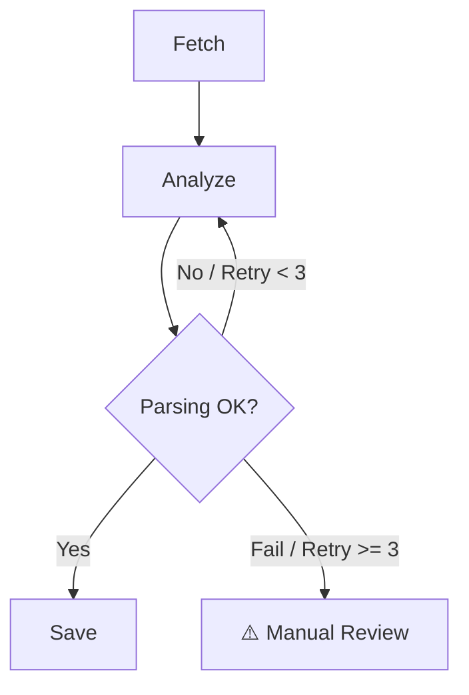

# 📊 AI Report Agent Architecture: Reliability over Optimization

> **"화려한 모델보다 중요한 건, 신뢰할 수 있는 데이터 파이프라인입니다."**  
> 이 문서는 AI 기반 주간 리포트 생성 시스템의 설계 의도와 데이터 무결성을 보장하기 위한 엔지니어링 전략을 기술합니다.

---

## 🏗️ 1. Logic Flow (데이터 처리 흐름)

이 에이전트는 **LangGraph**의 상태 관리(State Management) 기능을 활용하여 `Fetch` -> `Analyze` -> `Save`의 순차적 처리를 수행합니다.

```mermaid
graph LR
    Start([🚀 Start]) --> Fetch[📥 Fetch Data\n(DB & Parameters)]
    Fetch --> Analyze[🧠 Analyze Node\n(Metric Calc & AI Reasoning)]
    Analyze --> Save[💾 Save Node\n(DB Transaction)]
    Save --> End([🏁 End])
```

### **Step 1: Fetch Data (재료 준비)**
- **Role**: AI 분석에 필요한 Raw Data를 DB에서 수집하고, 정합성을 검증합니다.
- **Key Logic**:
  - `sales_daily` (매출) / `reviews` (리뷰) / `weather` (날씨) 데이터 병합
  - **Python Reducer**: AI에게 계산을 맡기지 않고, Python 코드로 직접 `Total Revenue`, `Growth Rate`를 선행 계산하여 `State`에 주입 (AI 연산 오류 방지).

### **Step 2: Analyze Data (분석 및 생성)**
- **Role**: 수치 데이터를 바탕으로 인사이트를 도출하고 구조화된 리포트를 생성합니다.
- **Engineering Point (Tag Parsing Strategy)**:
  - **문제**: LLM은 JSON 형식을 자주 틀리거나(Trailing Comma 등), 불필요한 서론(Preambles)을 붙이는 경향이 있음.
  - **해결**: XML 스타일의 태그(`<SECTION:SALES>`)를 도입하여 Regex로 파싱. **JSON 파싱보다 실패율이 현저히 낮음.**
  - **Fallback**: 파싱 실패 시 기본값(Default)을 반환하여 파이프라인 중단 방지.

### **Step 3: Save Data (저장 및 검증)**
- **Role**: 생성된 리포트를 DB(`store_reports`)에 저장합니다.
- **Safety Gate**: `risk_score` 등 필수 필드가 누락된 경우 저장을 건너뛰어(Skip), **"쓰레기 데이터(Garbage Data)"가 DB에 쌓이는 것을 원천 차단.**

---

## 💡 2. Core Engineering Decisions (기술적 의사결정)

### Q1. 왜 복잡한 Graph가 아닌 Linear Chain을 사용했나요?
초기 단계에서는 **"안정성(Stability)"**이 최우선입니다. 복잡한 분기 처리는 디버깅을 어렵게 만듭니다. 현재 구조는 명확한 `Input -> Process -> Output` 흐름을 가지며, LangGraph의 **State**를 활용해 데이터를 안전하게 전달하는 데 집중했습니다.

### Q2. JSON 대신 Tag Parsing을 쓴 이유는?
`json.loads()`는 단 하나의 콤마 에러에도 전체가 실패(Crash)합니다. 반면 Regex를 이용한 태그 추출 방식은 **부분적 성공(Partial Success)**이 가능하며, LLM의 불안정한 출력에 훨씬 강력(Robust)하게 대응할 수 있습니다. 이는 실무적인 **Reliability Engineering**의 일환입니다.

---

## 🚀 3. Future Improvements (향후 발전 계획)

현재의 선형 구조(Linear)를 넘어, **LangGraph의 순환(Cycle) 기능**을 도입하여 자율 수정 시스템으로 고도화할 계획입니다.

### **Self-Correction Loop (자율 수정)**
- **Current**: 파싱 실패 시 → `Error Log` 남기고 종료 (수동 확인 필요)
- **Proposed**: 파싱 실패 시 → **"형식이 잘못됐어, 다시 생성해"**라고 LLM에게 피드백을 주며 `Analyze` 노드로 회귀.
  - 이를 통해 인간의 개입 없이 **성공률을 99.9%까지** 끌어올릴 수 있음.


